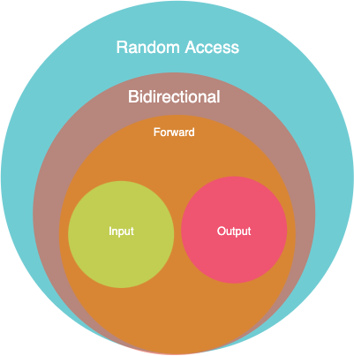

# ft_containers

DIY C++ containers implementation (C++98)

## Index

- [Index](#index)
- [Style Guide](#style-guide)
- [STL Containers](#stl-containers)
- [Background Information](#background-information)
  - [Allocator](#allocator)
  - [`noexcept`/`throw()`](#noexceptthrow)
  - [Iterators](#iterators)
    - [`iterator_traits`](#iterator-traits)
    - [Categories](#categories)
  - [Exception Safety](#exception-safety)
- [Vector](#vector)
- [Stack](#stack)
- [Map](#stack)
- [Set](#set-red-black-tree)
- [reverse_iterator](#reverse-iterator)

## Style Guide

- [Google C++ Style Guide](https://google.github.io/styleguide/cppguide.html)

## STL Containers

STL Containers library provide a collection of class templates and algorithms so that programmers can easily implement comman data structures and manipulate them. The container manages its storage space by allocating and/or deallocating memory depending on how many elements are present in it. Its elements are accessed either directly or through iterators by using member functions.

There are two types of containers, sequence containers and assiciative containers. In sequence containers, data structures can be accessed sequentially. Associative containers provide sorted data structures that can be quickly searched (O(log n) complexity). There also are three container adaptors, stack (LIFO), queue (FIFO), and priority queue, that are not pure containers, but provide different interfaces of sequential containers by utilizing them in their implementations.

- Sequence containers
  - [vector](https://cplusplus.com/reference/vector/vector/)
  - [deque](https://cplusplus.com/reference/deque/deque/)
  - [list](https://cplusplus.com/reference/list/list/)
- Associative containers
  - [set](https://cplusplus.com/reference/set/set/)
  - [multiset](https://cplusplus.com/reference/set/multiset/)
  - [map](https://cplusplus.com/reference/map/map/)
  - [multimap](https://cplusplus.com/reference/map/multimap/)
- Container adaptors
  - [stack](https://cplusplus.com/reference/stack/stack/)
  - [queue](https://cplusplus.com/reference/queue/queue/)
  - [priority_queue](https://cplusplus.com/reference/queue/priority_queue/)

## Background Information

### Allocator

- Containers manage storage space for their elements by utilizing [`std::allocator`](https://cplusplus.com/reference/memory/allocator/) objects to dynamically allocates and deallocate memory.
- `std::allocator` is stateless. ("all instances of the given allocator are interchangeable, compare equal and can deallocate memory allocated by any other instance of the same allocator type.")
- Why use `std::allocator` instead of using `new` and `delete` directly?
  - By using `std::allocator` allocation and construction, and deallocation and destruction can be performed separately.
  - [StackOverflow discussion](https://stackoverflow.com/questions/31358804/whats-the-advantage-of-using-stdallocator-instead-of-new-in-c#:~:text=new%20and%20delete%20are%20the,then%20finally%20deallocate%20the%20memory.)
- When deallocating memory space by using `std::allocator::deallocate`, the pointer that is being deallocated must be the one allocated by `std::allocator::allocate`, and the size argument must be equal to the one used by the allocator.

### `noexcept`/`throw()`

- A lot of member functions of STL Containers' declarations are followed by `noexcept` specifier.
- It is used to let the compiler know that the function will not throw exception.
- When an exception is thrown from a **NON-THROWING** function, `std::unexpected` is called, which will terminate the program by calling `std::terminate`.
- It is used for two main reasons: [(from Modernes C++)](https://www.modernescpp.com/index.php/c-core-guidelines-the-noexcept-specifier-and-operator)
  - documents the behaviour of the function (which means the function can be safely used in a non-throwing function)
  - optimises compilation
- In C++98 standard, only the dynamic exception specification using `throw()` is available instead of `noexcept`. Since such method does not improve performance like the `noexcept` does, a question arises whether `throw()` should be utilized in this implementation [(ref. StackOverflow)](https://stackoverflow.com/questions/13841559/deprecated-throw-list-in-c11). However, `throw()` was used for exiting the program by calling `std::unexpected -> std::terminate` when exception is thrown from a **NON-THROWING** function was deemed more important than slight performance improvement.

### Iterators

- An iterator is an object that points to some element in a range of elements (e.g. a pointer). By using operators (at least ++ and \*), it can iterate through the elements of that range.
- Each container type has its specific iterator type.
- All iterators, regardless of their categories, are at least:
  - copy-constructible
  - copy-assignable
  - destructible
  - can be incremented using `operator++`
  - can be dereferenced using `operator\*`

#### iterator_traits

- `iterator_traits` is a class that defines properties of iterators.
- For every iterator type, at least the following member types are defined to correspond its properties.
  - `difference_type`
  - `value_type`
  - `pointer`
  - `reference`
  - `iterator_category`
- These member types are checked by STL algorithms to determine properties of the iterators passed to them and the range they represent.

#### Categories

- There exist five different categories of iterators and their hierarchy is like the diagram below.
<figure>
<p align="center">
  </p>
  <figcaption align="center" style="font-weight: bold;">hierarchy between each iterator category (refer to the table in <a href="https://www.cplusplus.com/reference/iterator/">cplusplus.com</a> for further details)</figcaption>
  </figure>

- Random Access Iterator
  - access elements at an arbitrary offset position relative to the element they point to (same functionality as pointers)
  - access ranges non-sequentially
- Bidirectional Iterator
  - iterate through a range sequentially in both directions
- Forward Iterator
  - iterate through a range sequentially in one direction (beginning to end)
- Input Iterator
  - read only once, and the iterator is incremented
- Output Iterator
  - each element pointed by the iterator is written a value only once, and the iterator is incremented

### Exception Safety

- "An operation on an object is said to be exception safe if that operation leaves the object in a valid
  state when the operation is terminated by throwing an exception." (Bjarne Stroustrup, 2000)
- A set of C++ STL's exception-safety guarantees:
  - **Basic guarantee** (for all ops)
    - The basic invariants are maintained, no resources are leaked.
  - **Strong guarantee** (for key ops)
    - The object being manipulated remains in the same state as it was before the operation took place when an exception is thrown.
    - key ops e.g. : `push_back()`, `insert()`.
  - **Nothrow guarantee** (for some)
    - some ops such as destructors, `swap()`, `pop_back()` do not throw exceptions.
- "In OOP, an invariant is a set of assertions that must always hold true during the life of an object for the program to be valid." (from [StackExchange](https://softwareengineering.stackexchange.com/questions/32727/what-are-invariants-how-can-they-be-used-and-have-you-ever-used-it-in-your-pro), by Xavier Nodet) In the example below, `Safe` class requires successful allocation of `T`, an invariant, in order to be constructed. Therefore, `Safe` class is exception safe (basic guarantee).

```c++
template <typename T>
class Safe {
    T *p;
  public:
    Safe() : p(new T) {}
    ~Safe() { delete p; }
}
```

- It is recommended to aim for the strong exception-safety guarantee while providing the basic guarantee when writing a library. At the same time, it is better to keep templates exception-transparent (not handling all exceptions) so that the user can find the exact cause of a problem.
- Below are exception-safe implementation techniques:
  - try-block
  - [RAII](#raii)
  - do not let go of data before its replacement is stored.
  - leave objects in valid states when throwing/re-throwing an exception.

### RAII

- RAII stands for "resource acquisition is initialization." (Bjarne Stroustrup, 2000)
- RAII is a technique that "binds the life cycle of a resource that must be acquired before use (allocated heap memory, thread of execution, open socket, open file, locked mutex, disk space, database connection—anything that exists in limited supply) to the lifetime of an object." (from [cppreference.com](https://en.cppreference.com/w/cpp/language/raii))
- Such technique guarantees availability (while the holder object is alive) and relief (when the object is destroyed) of resources.
- In practice, RAII: (from [cppreference.com](https://en.cppreference.com/w/cpp/language/raii))
  - encapsulate each resource into a class, where
    - the constructor acquires the resource and establishes all class invariants or throws an exception if that cannot be done,
    - the destructor releases the resource and never throws exceptions;
  - always use the resource via an instance of a RAII-class that either - has automatic storage duration or temporary lifetime itself, or - has lifetime that is bounded by the lifetime of an automatic or temporary object

## Vector

### Features

- A vector container is an array that can change its size dynamically (using allocator object).
- It is a sequence container.
- Like arrays, data elements in a vector are stored in contiguous locations. Therefore, elements can be directly accessed, and the last element can be easily added or removed.

### Why is there `__vector_base` class?

- In STL Containers `std::vector` implementation, `vector_base` class functions as an [RAII](#raii) (exception-safety technique) wrapper.
- Aquisition of resources occur in the `vector_base` wrapper's instantiation and the resources are released when the wrapper is destroyed (after the instance of the inherited class is destroyed), so the `std::vector` instance can safely access the resources during its lifetime.

### Member Types

```C++
typedef T value_type;
typedef typename Alloc allocator_type;
typedef typename allocator_traits<allocator_type> alloc_traits;
typedef typename alloc_traits::size_type size_type;
typedef typename alloc_traits::difference_type difference_type;
typedef typename alloc_traits:: pointer;
typedef typename alloc_traits::const_pointer const_pointer;
typedef typename alloc_traits::reference reference;
typedef typename alloc_traits::const_reference const_reference;
typedef pointer iterator;              // FIXME
typedef const_pointer const_iterator;  // FIXME
typedef std::reverse_iterator<iterator> reverse_iterator; // FIXME
typedef std::reverse_iterator<const_iterator> const_reverse_iterator; // FIXME
```

### Member Functions

#### Constructors & Destructors

```C++
// Constructors
// #1 default : empty container constructor (no elem)
explicit vector(const allocator_type& alloc = allocator_type());

// #2 fill : construct a container with n elements, fill them with val
explicit vector(size_type n, const value_type& val,
                const allocator_type& alloc = allocator_type());

// #3 range : construct a container that will contain the same values in the range [first, last)
template <typename InputIterator>
vector(InputIterator first, InputIterator last,
        const allocator_type& alloc = allocator_type());

// #4 copy constructor (keeps and uses a copy of x's alloc)
vector(const vector& x);

// Destructor
~vector(void) FT_NOEXCEPT_

```

- **Exception Safety** : strong guarantee for the constructors & non-throwing for the destructor

- **UNDEFINED BEHAVIOUR** in case inappropriate arguments have been passed to `allocator_traits::construct` for the element constructions, or the range specified by [first,last) is not valid.

- `explicit` specifier specifies that the constructors followed by the keyword cannot be used for implicit conversions and copy-initialization.

#### Iterators

```C++
// Iterators
iterator begin(void) FT_NOEXCEPT_;
const_iterator begin(void) const FT_NOEXCEPT_;
reverse_iterator rbegin(void) FT_NOEXCEPT_;
const_reverse_iterator rbegin(void) const FT_NOEXCEPT_;
iterator end(void) FT_NOEXCEPT_;
const_iterator end(void) const FT_NOEXCEPT_;
reverse_iterator rend(void) FT_NOEXCEPT_;
const_reverse_iterator rend(void) const FT_NOEXCEPT_;
```

- **Exception Safety** : non-throwing

#### Capacity

```C++
// size : returns a number of elements in the vector
size_type size(void) const FT_NOEXCEPT_;

// max_size : returns the max number of elements the vector can hold theoretically
// (depends on the system limit)
size_type max_size(void) const FT_NOEXCEPT_;

// resize : resizes the container so that it contains n elements
// If n < size(), elements beyond the first n elements are destroyed.
// If n > size(), elements(val) are inserted at the end until n == size().
// If n > capacity(), reallocation takes place.
void resize(size_type n, value_type val = value_type());

// capacity : returns the size of allocated storage capacity
size_type capacity(void) const FT_NOEXCEPT_;

// empty : returns whether the vector is empty
bool empty(void) const FT_NOEXCEPT_;

// reserve : only when n is greater than capacity(), reallocation to increase space capacity to n takes place.
void reserve(size_type n);
```

- **Exception Safety** :

  - `vector::resize`

    - `n` <= `size()`, no-throw guarantee
    - `n` > `size()` & reallocation, strong guarantee if the type of the elements is either copyable or no-throw moveable
    - else basic guarantee

  - `vector::reserve`
    - strong guarantee if no reallocations happens / the elements has either a non-throwing move constructor or a copy constructor
    - else basic guarantee.
    - `std::length_error` is thrown if n is greater than `max_size()`

#### Element Access

```C++
// Subscript & at
// returns reference of n-th element of the vector
reference operator[](size_type n) FT_NOEXCEPT_;
const_reference operator[](size_type n) const FT_NOEXCEPT_;
reference at(size_type n);
const_reference at(size_type n) const;

// front & back
// front returns the reference of the first element
// back returns the reference of the last element
reference front(void) FT_NOEXCEPT_;
const_reference front(void) const FT_NOEXCEPT_;
reference back(void) FT_NOEXCEPT_;
const_reference back(void) const FT_NOEXCEPT_;
```

- **Exception Safety** :
  - `operator[]`
    - non-throwing, if `n` >= `size()`, UB
  - `at`
    - strong guarantee
    - checks whether `n` is in range, if not throws `std::out_of_range`
  - `front` & `back`
    - non-throwing, if empty, UB

#### Modifiers

#### `get_allocator`

## Stack

## Map

## Set (Red Black Tree)

## `reverse_iterator`

## TODO

### STL Containers

- [ ] vector
- [ ] map
- [ ] stack (DIY vector class as default underlying container)
- [ ] set (Red-Black Tree)

### iterators & algorithms

- [ ] iterators_traits
- [ ] reverse_iterator
- [ ] enable_if
- [ ] is_integral
- [ ] equal, lexicographical_compare
- [ ] std::pair
- [ ] std::make_pair

## References

- [cplusplus.com](http://cplusplus.com/)
- [cppreference.com](https://en.cppreference.com/w/)
- [gnu containers source](https://github.com/gcc-mirror/gcc/tree/master/libstdc%2B%2B-v3/include/bits)
- [llvm containers source](https://github.com/llvm/llvm-project/tree/main/libcxx)
- [Bjarne Stroustrup (2000). The C++ programming language. Boston: Addison-Wesley.](https://www.stroustrup.com/3rd_safe.pdf)

‌
